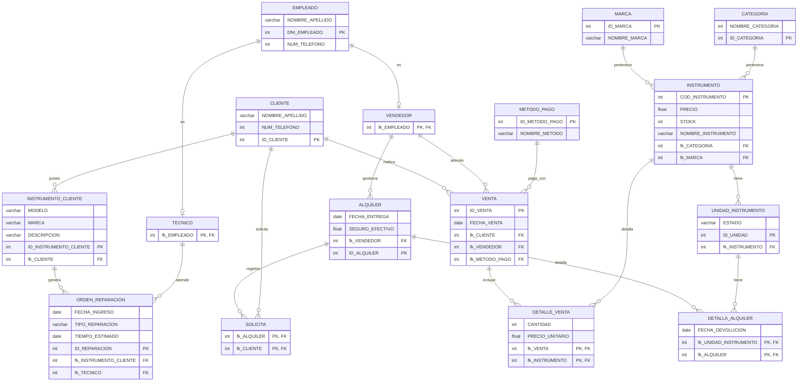

# Modelo Relacional - Sonora Instrumentos (verificado en 3FN)

```mermaid
erDiagram
    INSTRUMENTO_CLIENTE {
        varchar MODELO
        varchar MARCA
        varchar DESCRIPCION
        int ID_INSTRUMENTO_CLIENTE PK
        int fk_CLIENTE FK
    }

    ORDEN_REPARACION {
        date FECHA_INGRESO
        varchar TIPO_REPARACION
        date TIEMPO_ESTIMADO
        int ID_REPARACION PK
        int fk_INSTRUMENTO_CLIENTE FK
        int fk_TECNICO FK
    }

    CLIENTE {
        varchar NOMBRE_APELLIDO
        int NUM_TELEFONO
        int ID_CLIENTE PK
    }

    ALQUILER {
        date FECHA_ENTREGA
        float SEGURO_EFECTIVO
        int fk_VENDEDOR FK
        int ID_ALQUILER PK
    }

    VENTA {
        int ID_VENTA PK
        date FECHA_VENTA
        int fk_CLIENTE FK
        int fk_VENDEDOR FK
        int fk_METODO_PAGO FK
    }

    METODO_PAGO {
        int ID_METODO_PAGO PK
        varchar NOMBRE_METODO
    }

    DETALLE_VENTA {
        int CANTIDAD
        float PRECIO_UNITARIO
        int fk_VENTA "PK, FK"
        int fk_INSTRUMENTO "PK, FK"
    }

    DETALLA_ALQUILER {
        date FECHA_DEVOLUCION
        int fk_UNIDAD_INSTRUMENTO "PK, FK"
        int fk_ALQUILER "PK, FK"
    }

    VENDEDOR {
        int fk_EMPLEADO "PK, FK"
    }

    UNIDAD_INSTRUMENTO {
        varchar ESTADO
        int ID_UNIDAD PK
        int fk_INSTRUMENTO FK
    }

    CATEGORIA {
        int NOMBRE_CATEGORIA
        int ID_CATEGORIA PK
    }

    INSTRUMENTO {
        int COD_INSTRUMENTO PK
        float PRECIO
        int STOCK
        varchar NOMBRE_INSTRUMENTO
        int fk_CATEGORIA FK
        int fk_MARCA FK
    }

    EMPLEADO {
        varchar NOMBRE_APELLIDO
        int DNI_EMPLEADO PK
        int NUM_TELEFONO
    }

    TECNICO {
        int fk_EMPLEADO "PK, FK"
    }

    SOLICITA {
        int fk_ALQUILER "PK, FK"
        int fk_CLIENTE "PK, FK"
    }

    MARCA {
        int ID_MARCA PK
        varchar NOMBRE_MARCA
    }

    EMPLEADO ||--o| VENDEDOR : "es"
    EMPLEADO ||--o| TECNICO : "es"
    MARCA ||--o{ INSTRUMENTO : "pertenece"
    CATEGORIA ||--o{ INSTRUMENTO : "pertenece"
    INSTRUMENTO ||--o{ UNIDAD_INSTRUMENTO : "tiene"
    CLIENTE ||--o{ VENTA : "realiza"
    VENDEDOR ||--o{ VENTA : "atiende"
    METODO_PAGO ||--o{ VENTA : "paga_con"
    VENTA ||--o{ DETALLE_VENTA : "incluye"
    INSTRUMENTO ||--o{ DETALLE_VENTA : "detalla"
    VENDEDOR ||--o{ ALQUILER : "gestiona"
    ALQUILER ||--o{ SOLICITA : "registra"
    CLIENTE ||--o{ SOLICITA : "solicita"
    ALQUILER ||--o{ DETALLA_ALQUILER : "detalla"
    UNIDAD_INSTRUMENTO ||--o{ DETALLA_ALQUILER : "tiene"
    CLIENTE ||--o{ INSTRUMENTO_CLIENTE : "posee"
    INSTRUMENTO_CLIENTE ||--o{ ORDEN_REPARACION : "genera"
    TECNICO ||--o{ ORDEN_REPARACION : "atiende"
```
