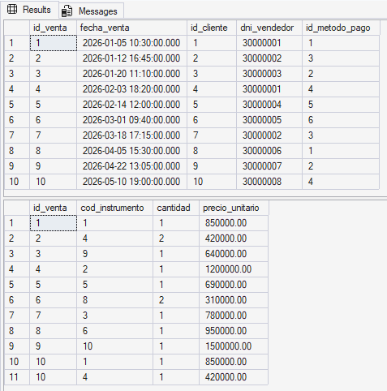
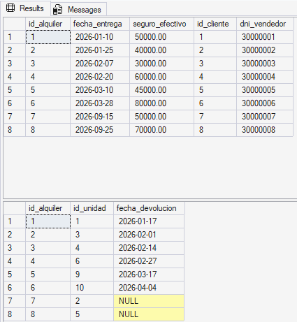
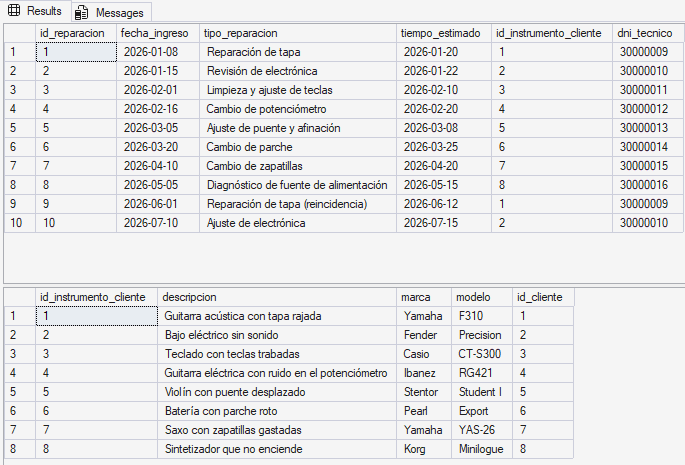

# Pruebas y validación - Sonora Instrumentos

Pruebas hechas sobre SQL Server Express, base `SonoraInstrumentos`, con el DDL y el DML de `implementacion.md` ya cargados.

## 1. Verificación de la carga de datos

Se corrió un SELECT * FROM por cada tabla y se contaron las filas a mano en la grilla de resultados:

```sql
SELECT * FROM Marca;
SELECT * FROM Categoria;
SELECT * FROM MetodoPago;
SELECT * FROM Instrumento;
SELECT * FROM UnidadInstrumento;
SELECT * FROM Cliente;
SELECT * FROM Empleado;
SELECT * FROM Vendedor;
SELECT * FROM Tecnico;
SELECT * FROM Venta;
SELECT * FROM DetalleVenta;
SELECT * FROM Alquiler;
SELECT * FROM DetalleAlquiler;
SELECT * FROM InstrumentoCliente;
SELECT * FROM OrdenReparacion;
```
Filas obtenidas:

| Tabla | Filas |
|---|---|
| Marca | 8 |
| Categoria | 8 |
| MetodoPago | 8 |
| Instrumento | 10 |
| UnidadInstrumento | 10 |
| Cliente | 10 |
| Empleado | 16 |
| Vendedor | 8 |
| Tecnico | 8 |
| Venta | 10 |
| DetalleVenta | 11 |
| Alquiler | 8 |
| DetalleAlquiler | 8 |
| InstrumentoCliente | 8 |
| OrdenReparacion | 10 |

DetalleVenta tiene 11 filas en vez de 10 porque la venta 10 quedó cargada con dos instrumentos. Empleado tiene 16 porque son 8 vendedores más 8 técnicos, no un valor arbitrario.


### 2 Ventas

```sql
SELECT * FROM Venta;
SELECT * FROM DetalleVenta;
```



La venta 1 tiene id_cliente = 1 y  dni_vendedor = 30000001; buscando esos valores en Cliente y Empleado da Lucas Fernández atendido por Carlos Méndez, pagada en efectivo (id_metodo_pago = 1). En DetalleVenta, la fila (1, 1, 1, 850000.00) es el total de esa venta. La venta 10 tiene dos filas de detalle — (10, 1, 1, 850000.00) y (10, 4, 1, 420000.00)` — que suman $1.270.000.

### 2.1 Alquileres

```sql
SELECT * FROM Alquiler;
SELECT * FROM DetalleAlquiler;
```



Cruzando por `id_alquiler`: los alquileres 1 a 6 tienen una fecha en `fecha_devolucion`, y los alquileres 7 y 8 la tienen en `NULL` — siguen activos.

### 2.2 Órdenes de reparación

```sql
SELECT * FROM OrdenReparacion;
SELECT * FROM InstrumentoCliente;
```



Todos los dni_tecnico de OrdenReparacion corresponden a filas de la tabla Tecnico, ningún vendedor aparece ahí. Los id_instrumento_cliente 1 y 2 se repiten (filas 9 y 10): esos dos instrumentos volvieron a entrar en reparación, que es justo lo que permite RN11.

## 3. Pruebas de restricciones (casos negativos)

| N.º | Prueba | Regla | Se esperaba | Resultado |

| P1 | Insertar cliente con DNI ya existente | RN01 | Rechazado | Rechazado (error 2627) |
| P2 | Precio negativo en un instrumento | `CHECK` precio | Rechazado | Rechazado (error 547) |
| P3 | Stock negativo | `CHECK` stock | Rechazado | Rechazado (error 547) |
| P4 | Stock en cero | Permitido | Aceptado | Aceptado |
| P5 | Registrar como técnico a alguien que ya es vendedor | RN13 | Rechazado | Rechazado (error 547) |
| P6 | Orden de reparación con un vendedor como técnico | RN12 | Rechazado | Rechazado (error 547) |
| P7 | Venta con cliente inexistente | FK | Rechazado | Rechazado (error 547) |
| P8 | Venta atendida por un técnico | RN04 | Rechazado | Rechazado (error 547) |
| P9 | Borrar un cliente con ventas | `ON DELETE NO ACTION` | Rechazado | Rechazado (error 547) |
| P10 | Borrar una venta | `ON DELETE CASCADE` | Se borra el detalle también | Detalle eliminado |
| P11 | Unidad con estado `'Roto'` | `CHECK` estado | Rechazado | Rechazado (error 547) |
| P12 | Fecha estimada antes que la de ingreso | `CHECK` fechas | Rechazado | Rechazado (error 547) |
| P13 | Instrumento sin nombre | `NOT NULL` | Rechazado | Rechazado (error 515) |
| P14 | Mismo instrumento dos veces en una venta | PK compuesta | Rechazado | Rechazado (error 2627) |

Las 14 pruebas dieron lo que esperábamos.
